[Issues as incident reports](https://github.com/h3infra/orderart-monitor/issues)

<!--start: status pages-->
<!-- This summary is generated by Upptime (https://github.com/upptime/upptime) -->
<!-- Do not edit this manually, your changes will be overwritten -->
<!-- prettier-ignore -->
| URL | Status | History | Response Time | Uptime |
| --- | ------ | ------- | ------------- | ------ |
|  [OrderArt POS](https://pos.orderart.com.au/) | 🟩 Up | [order-art-pos.yml](https://github.com/h3infra/orderart-monitor/commits/HEAD/history/order-art-pos.yml) | 

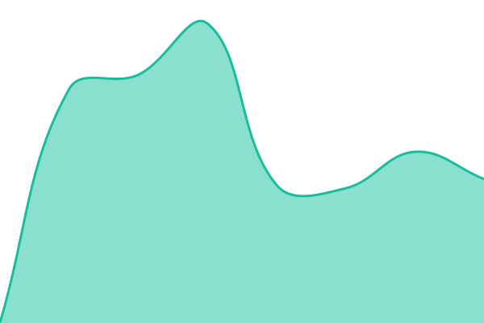 337ms
     
 | 

<a href="https://h3infra.github.io/orderart-monitor/history/order-art-pos">100.00%</a>
    

|  [OrderArt Admin](https://admin.orderart.com.au/) | 🟩 Up | [order-art-admin.yml](https://github.com/h3infra/orderart-monitor/commits/HEAD/history/order-art-admin.yml) | 

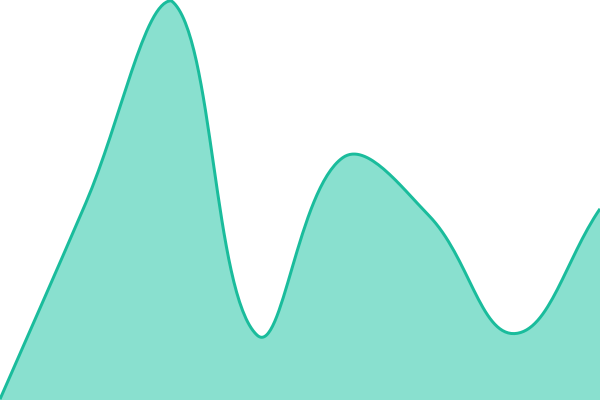 242ms
     
 | 

<a href="https://h3infra.github.io/orderart-monitor/history/order-art-admin">100.00%</a>
    

|  [OrderArt Restroadmin](https://fran-trish.orderart.io/) | 🟩 Up | [order-art-restroadmin.yml](https://github.com/h3infra/orderart-monitor/commits/HEAD/history/order-art-restroadmin.yml) | 

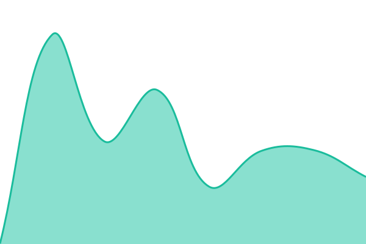 316ms
     
 | 

<a href="https://h3infra.github.io/orderart-monitor/history/order-art-restroadmin">100.00%</a>
    

|  [Orderart](https://www.orderart.com.au/) | 🟩 Up | [orderart.yml](https://github.com/h3infra/orderart-monitor/commits/HEAD/history/orderart.yml) | 

 667ms
     
 | 

<a href="https://h3infra.github.io/orderart-monitor/history/orderart">100.00%</a>
    

|  [Fathimas Indian Kitchen](https://www.fathimasindiankitchen.com.au) | 🟩 Up | [fathimas-indian-kitchen.yml](https://github.com/h3infra/orderart-monitor/commits/HEAD/history/fathimas-indian-kitchen.yml) | 

 1141ms
     
 | 

<a href="https://h3infra.github.io/orderart-monitor/history/fathimas-indian-kitchen">100.00%</a>
    

|  [Shanika Berwick](https://berwick.shanikas.com.au) | 🟩 Up | [shanika-berwick.yml](https://github.com/h3infra/orderart-monitor/commits/HEAD/history/shanika-berwick.yml) | 

 2752ms
     
 | 

<a href="https://h3infra.github.io/orderart-monitor/history/shanika-berwick">100.00%</a>
    

|  [Amici](https://www.amici.com.au) | 🟩 Up | [amici.yml](https://github.com/h3infra/orderart-monitor/commits/HEAD/history/amici.yml) | 

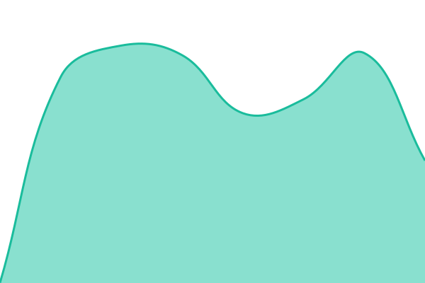 868ms
     
 | 

<a href="https://h3infra.github.io/orderart-monitor/history/amici">100.00%</a>
    

|  [Shanika Pakenham](https://pakenham.shanikas.com.au) | 🟩 Up | [shanika-pakenham.yml](https://github.com/h3infra/orderart-monitor/commits/HEAD/history/shanika-pakenham.yml) | 

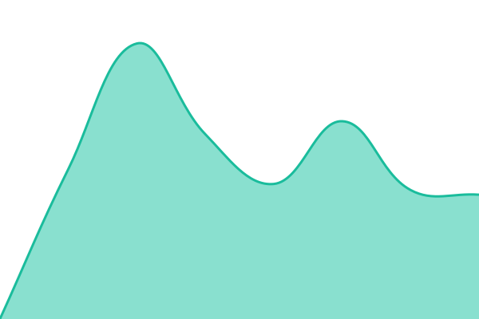 1428ms
     
 | 

<a href="https://h3infra.github.io/orderart-monitor/history/shanika-pakenham">100.00%</a>
    

|  [Tawa](https://www.tawa.com.au) | 🟩 Up | [tawa.yml](https://github.com/h3infra/orderart-monitor/commits/HEAD/history/tawa.yml) | 

 837ms
     
 | 

<a href="https://h3infra.github.io/orderart-monitor/history/tawa">100.00%</a>
    

|  [Sahotas Live Grill](https://www.sahotaslivegrill.com) | 🟩 Up | [sahotas-live-grill.yml](https://github.com/h3infra/orderart-monitor/commits/HEAD/history/sahotas-live-grill.yml) | 

 768ms
     
 | 

<a href="https://h3infra.github.io/orderart-monitor/history/sahotas-live-grill">100.00%</a>
    

|  [Sahotas Abbotsford](https://abbotsford.sahotaslivegrill.com/) | 🟩 Up | [sahotas-abbotsford.yml](https://github.com/h3infra/orderart-monitor/commits/HEAD/history/sahotas-abbotsford.yml) | 

 802ms
     
 | 

<a href="https://h3infra.github.io/orderart-monitor/history/sahotas-abbotsford">100.00%</a>
    

|  [Sahotas Langley](https://langley.sahotaslivegrill.com/) | 🟩 Up | [sahotas-langley.yml](https://github.com/h3infra/orderart-monitor/commits/HEAD/history/sahotas-langley.yml) | 

 894ms
     
 | 

<a href="https://h3infra.github.io/orderart-monitor/history/sahotas-langley">100.00%</a>
    

|  [Sahotas Surrey](https://surrey.sahotaslivegrill.com/) | 🟩 Up | [sahotas-surrey.yml](https://github.com/h3infra/orderart-monitor/commits/HEAD/history/sahotas-surrey.yml) | 

 809ms
     
 | 

<a href="https://h3infra.github.io/orderart-monitor/history/sahotas-surrey">100.00%</a>
    

|  [Roti Boti Online](https://online.rotiboti.com.au/) | 🟩 Up | [roti-boti-online.yml](https://github.com/h3infra/orderart-monitor/commits/HEAD/history/roti-boti-online.yml) | 

 952ms
     
 | 

<a href="https://h3infra.github.io/orderart-monitor/history/roti-boti-online">100.00%</a>
    

|  [Mirch Masala Delta](https://delta.mirchmasala.ca/) | 🟩 Up | [mirch-masala-delta.yml](https://github.com/h3infra/orderart-monitor/commits/HEAD/history/mirch-masala-delta.yml) | 

 726ms
     
 | 

<a href="https://h3infra.github.io/orderart-monitor/history/mirch-masala-delta">100.00%</a>
    

|  [Carlos Cantina Boronia](https://boronia.carloscantina.com.au/) | 🟩 Up | [carlos-cantina-boronia.yml](https://github.com/h3infra/orderart-monitor/commits/HEAD/history/carlos-cantina-boronia.yml) | 

 759ms
     
 | 

<a href="https://h3infra.github.io/orderart-monitor/history/carlos-cantina-boronia">100.00%</a>
    

|  [Carlos Cantina Blackburn](https://blackburn.carloscantina.com.au/) | 🟩 Up | [carlos-cantina-blackburn.yml](https://github.com/h3infra/orderart-monitor/commits/HEAD/history/carlos-cantina-blackburn.yml) | 

 739ms
     
 | 

<a href="https://h3infra.github.io/orderart-monitor/history/carlos-cantina-blackburn">100.00%</a>
    

|  [Carlos Cantina Croydon](https://croydon.carloscantina.com.au/) | 🟩 Up | [carlos-cantina-croydon.yml](https://github.com/h3infra/orderart-monitor/commits/HEAD/history/carlos-cantina-croydon.yml) | 

 690ms
     
 | 

<a href="https://h3infra.github.io/orderart-monitor/history/carlos-cantina-croydon">100.00%</a>
    

|  [Priya Caroline Springs](https://carolinesprings.priyaindiancuisine.com.au/) | 🟩 Up | [priya-caroline-springs.yml](https://github.com/h3infra/orderart-monitor/commits/HEAD/history/priya-caroline-springs.yml) | 

 813ms
     
 | 

<a href="https://h3infra.github.io/orderart-monitor/history/priya-caroline-springs">100.00%</a>
    

|  [Priya Point Cook](https://pointcook.priyaindiancuisine.com.au/) | 🟩 Up | [priya-point-cook.yml](https://github.com/h3infra/orderart-monitor/commits/HEAD/history/priya-point-cook.yml) | 

 875ms
     
 | 

<a href="https://h3infra.github.io/orderart-monitor/history/priya-point-cook">100.00%</a>
    

|  [Rose of Australia Online](https://online.roseofaustraliahotel.com.au/) | 🟩 Up | [rose-of-australia-online.yml](https://github.com/h3infra/orderart-monitor/commits/HEAD/history/rose-of-australia-online.yml) | 

 792ms
     
 | 

<a href="https://h3infra.github.io/orderart-monitor/history/rose-of-australia-online">100.00%</a>
    

|  [Dez Indian](https://www.dezindian.com.au/) | 🟩 Up | [dez-indian.yml](https://github.com/h3infra/orderart-monitor/commits/HEAD/history/dez-indian.yml) | 

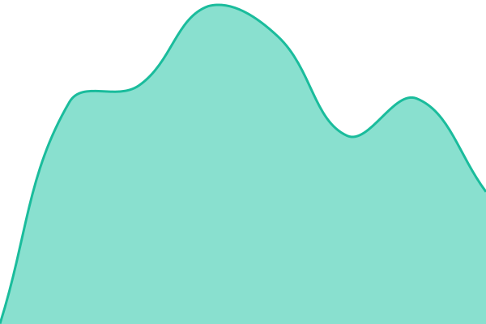 746ms
     
 | 

<a href="https://h3infra.github.io/orderart-monitor/history/dez-indian">100.00%</a>
    

|  [Taj Mahal Daylesford](https://www.tajmahaldaylesford.com.au/) | 🟩 Up | [taj-mahal-daylesford.yml](https://github.com/h3infra/orderart-monitor/commits/HEAD/history/taj-mahal-daylesford.yml) | 

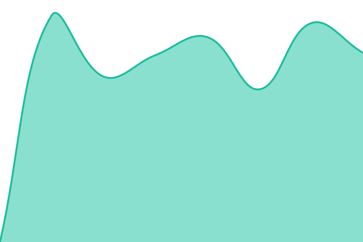 782ms
     
 | 

<a href="https://h3infra.github.io/orderart-monitor/history/taj-mahal-daylesford">100.00%</a>
    

|  [Mexico City Cantina](https://www.mexicocitycantina.com.au/) | 🟩 Up | [mexico-city-cantina.yml](https://github.com/h3infra/orderart-monitor/commits/HEAD/history/mexico-city-cantina.yml) | 

 763ms
     
 | 

<a href="https://h3infra.github.io/orderart-monitor/history/mexico-city-cantina">100.00%</a>
    

|  [Patiala Shahi](https://www.patialashahi.com.au/) | 🟩 Up | [patiala-shahi.yml](https://github.com/h3infra/orderart-monitor/commits/HEAD/history/patiala-shahi.yml) | 

 787ms
     
 | 

<a href="https://h3infra.github.io/orderart-monitor/history/patiala-shahi">100.00%</a>
    

|  [Whistling Kettle](https://www.whistlingkettle.com.au/) | 🟩 Up | [whistling-kettle.yml](https://github.com/h3infra/orderart-monitor/commits/HEAD/history/whistling-kettle.yml) | 

 858ms
     
 | 

<a href="https://h3infra.github.io/orderart-monitor/history/whistling-kettle">100.00%</a>
    

|  [St Martins Cafe](https://www.stmartinscafe.com.au/) | 🟩 Up | [st-martins-cafe.yml](https://github.com/h3infra/orderart-monitor/commits/HEAD/history/st-martins-cafe.yml) | 

 778ms
     
 | 

<a href="https://h3infra.github.io/orderart-monitor/history/st-martins-cafe">100.00%</a>
    

|  [Matildas Woodfired](https://www.matildaswoodfiredkitchen.com.au/) | 🟩 Up | [matildas-woodfired.yml](https://github.com/h3infra/orderart-monitor/commits/HEAD/history/matildas-woodfired.yml) | 

 805ms
     
 | 

<a href="https://h3infra.github.io/orderart-monitor/history/matildas-woodfired">100.00%</a>
    

|  [Punjabees Hendra](https://hendra.punjabeezindianrestaurant.com.au/) | 🟩 Up | [punjabees-hendra.yml](https://github.com/h3infra/orderart-monitor/commits/HEAD/history/punjabees-hendra.yml) | 

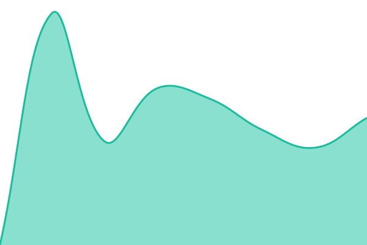 722ms
     
 | 

<a href="https://h3infra.github.io/orderart-monitor/history/punjabees-hendra">100.00%</a>
    

|  [Punjabees Camira](https://camira.punjabeezindianrestaurant.com.au/) | 🟩 Up | [punjabees-camira.yml](https://github.com/h3infra/orderart-monitor/commits/HEAD/history/punjabees-camira.yml) | 

 758ms
     
 | 

<a href="https://h3infra.github.io/orderart-monitor/history/punjabees-camira">100.00%</a>
    

|  [Punjabees Chermside West](https://chermsidewest.punjabeezindianrestaurant.com.au/) | 🟩 Up | [punjabees-chermside-west.yml](https://github.com/h3infra/orderart-monitor/commits/HEAD/history/punjabees-chermside-west.yml) | 

 987ms
     
 | 

<a href="https://h3infra.github.io/orderart-monitor/history/punjabees-chermside-west">100.00%</a>
    

|  [Maharaja Online](https://www.maharajaonline.com.au/) | 🟩 Up | [maharaja-online.yml](https://github.com/h3infra/orderart-monitor/commits/HEAD/history/maharaja-online.yml) | 

 766ms
     
 | 

<a href="https://h3infra.github.io/orderart-monitor/history/maharaja-online">100.00%</a>
    

|  [Maharaja Epping](https://epping.maharajaonline.com.au/) | 🟩 Up | [maharaja-epping.yml](https://github.com/h3infra/orderart-monitor/commits/HEAD/history/maharaja-epping.yml) | 

 1040ms
     
 | 

<a href="https://h3infra.github.io/orderart-monitor/history/maharaja-epping">100.00%</a>
    

|  [Maharaja Northcote](https://northcote.maharajaonline.com.au/) | 🟩 Up | [maharaja-northcote.yml](https://github.com/h3infra/orderart-monitor/commits/HEAD/history/maharaja-northcote.yml) | 

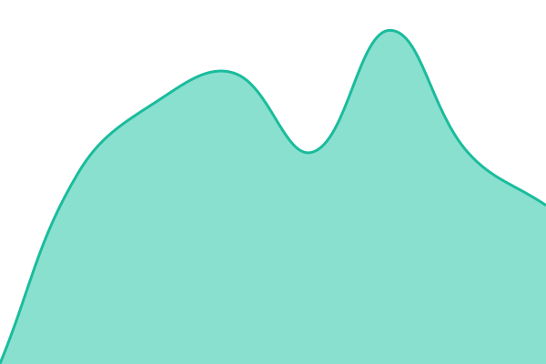 727ms
     
 | 

<a href="https://h3infra.github.io/orderart-monitor/history/maharaja-northcote">100.00%</a>
    

|  [Maharaja Preston](https://preston.maharajaonline.com.au/) | 🟩 Up | [maharaja-preston.yml](https://github.com/h3infra/orderart-monitor/commits/HEAD/history/maharaja-preston.yml) | 

 680ms
     
 | 

<a href="https://h3infra.github.io/orderart-monitor/history/maharaja-preston">100.00%</a>
    

|  [Taste of Amritsar](https://www.tasteofamritsar.com.au/) | 🟩 Up | [taste-of-amritsar.yml](https://github.com/h3infra/orderart-monitor/commits/HEAD/history/taste-of-amritsar.yml) | 

 1158ms
     
 | 

<a href="https://h3infra.github.io/orderart-monitor/history/taste-of-amritsar">100.00%</a>
    

|  [Rococo Hawthorn](https://hawthorn.rococo.net.au/) | 🟩 Up | [rococo-hawthorn.yml](https://github.com/h3infra/orderart-monitor/commits/HEAD/history/rococo-hawthorn.yml) | 

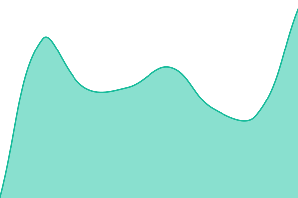 1079ms
     
 | 

<a href="https://h3infra.github.io/orderart-monitor/history/rococo-hawthorn">100.00%</a>
    

|  [Rococo St Kilda](https://stkilda.rococo.net.au/) | 🟩 Up | [rococo-st-kilda.yml](https://github.com/h3infra/orderart-monitor/commits/HEAD/history/rococo-st-kilda.yml) | 

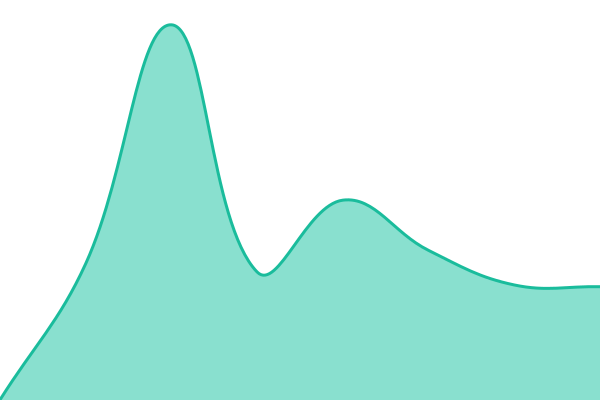 950ms
     
 | 

<a href="https://h3infra.github.io/orderart-monitor/history/rococo-st-kilda">100.00%</a>
    

|  [Rococo Point Cook](https://pointcook.rococo.net.au/) | 🟩 Up | [rococo-point-cook.yml](https://github.com/h3infra/orderart-monitor/commits/HEAD/history/rococo-point-cook.yml) | 

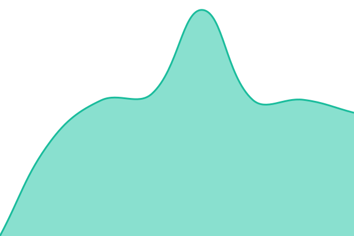 789ms
     
 | 

<a href="https://h3infra.github.io/orderart-monitor/history/rococo-point-cook">100.00%</a>
    

|  [Khanapeena 80Ave](https://80ave.khanapeenalounge.com/) | 🟥 Down | [khanapeena-80-ave.yml](https://github.com/h3infra/orderart-monitor/commits/HEAD/history/khanapeena-80-ave.yml) | 

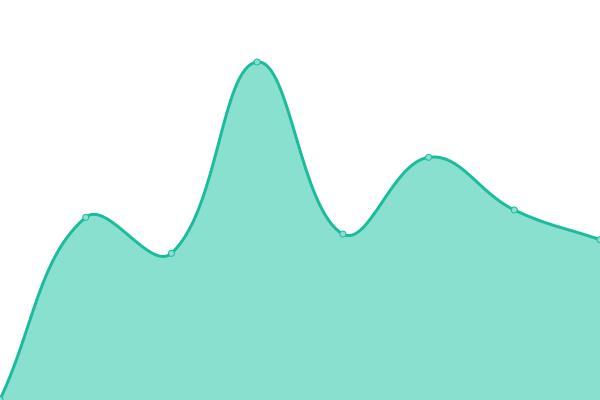 0ms
     
 | 

<a href="https://h3infra.github.io/orderart-monitor/history/khanapeena-80-ave">100.00%</a>
    

|  [Khanapeena King George](https://kinggeorge.khanapeenalounge.com/) | 🟥 Down | [khanapeena-king-george.yml](https://github.com/h3infra/orderart-monitor/commits/HEAD/history/khanapeena-king-george.yml) | 

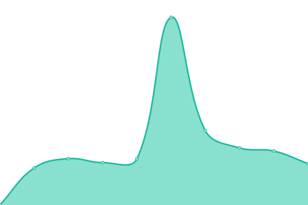 0ms
     
 | 

<a href="https://h3infra.github.io/orderart-monitor/history/khanapeena-king-george">100.00%</a>
    

|  [Delight Street Eats](https://www.delightstreeteats.com/) | 🟩 Up | [delight-street-eats.yml](https://github.com/h3infra/orderart-monitor/commits/HEAD/history/delight-street-eats.yml) | 

 688ms
     
 | 

<a href="https://h3infra.github.io/orderart-monitor/history/delight-street-eats">100.00%</a>
    

|  [Maharani Sweets](https://www.maharanisweetsandrestaurant.ca/) | 🟩 Up | [maharani-sweets.yml](https://github.com/h3infra/orderart-monitor/commits/HEAD/history/maharani-sweets.yml) | 

 716ms
     
 | 

<a href="https://h3infra.github.io/orderart-monitor/history/maharani-sweets">100.00%</a>
    

|  [Tikka Shikka Wok](https://www.tikkashikkaandwok.ca/) | 🟩 Up | [tikka-shikka-wok.yml](https://github.com/h3infra/orderart-monitor/commits/HEAD/history/tikka-shikka-wok.yml) | 

 976ms
     
 | 

<a href="https://h3infra.github.io/orderart-monitor/history/tikka-shikka-wok">100.00%</a>
    

|  [Desi Bites](https://www.desibites.ca/) | 🟩 Up | [desi-bites.yml](https://github.com/h3infra/orderart-monitor/commits/HEAD/history/desi-bites.yml) | 

 716ms
     
 | 

<a href="https://h3infra.github.io/orderart-monitor/history/desi-bites">100.00%</a>
    

|  [Ustaad G Scott Road](https://www.ustaadgscottroad.ca/) | 🟩 Up | [ustaad-g-scott-road.yml](https://github.com/h3infra/orderart-monitor/commits/HEAD/history/ustaad-g-scott-road.yml) | 

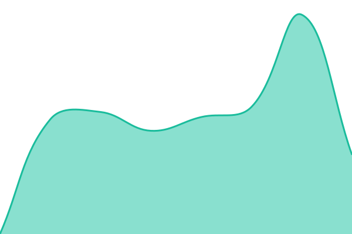 686ms
     
 | 

<a href="https://h3infra.github.io/orderart-monitor/history/ustaad-g-scott-road">100.00%</a>
    

|  [Kathmandu Guildford](https://guildford.kathmandubarandgrill.ca/) | 🟩 Up | [kathmandu-guildford.yml](https://github.com/h3infra/orderart-monitor/commits/HEAD/history/kathmandu-guildford.yml) | 

 710ms
     
 | 

<a href="https://h3infra.github.io/orderart-monitor/history/kathmandu-guildford">100.00%</a>
    

|  [Kathmandu Main](https://www.kathmandubarandgrill.ca/) | 🟩 Up | [kathmandu-main.yml](https://github.com/h3infra/orderart-monitor/commits/HEAD/history/kathmandu-main.yml) | 

 671ms
     
 | 

<a href="https://h3infra.github.io/orderart-monitor/history/kathmandu-main">100.00%</a>
    

|  [Kurrywala](https://www.kurrywala.net/) | 🟩 Up | [kurrywala.yml](https://github.com/h3infra/orderart-monitor/commits/HEAD/history/kurrywala.yml) | 

 751ms
     
 | 

<a href="https://h3infra.github.io/orderart-monitor/history/kurrywala">100.00%</a>
    

|  [Himalaya Indian Cuisine](https://www.himalayaindiancuisine.ca/) | 🟩 Up | [himalaya-indian-cuisine.yml](https://github.com/h3infra/orderart-monitor/commits/HEAD/history/himalaya-indian-cuisine.yml) | 

 732ms
     
 | 

<a href="https://h3infra.github.io/orderart-monitor/history/himalaya-indian-cuisine">100.00%</a>
    

|  [Spice 72](https://online.spice72.com/) | 🟩 Up | [spice-72.yml](https://github.com/h3infra/orderart-monitor/commits/HEAD/history/spice-72.yml) | 

 991ms
     
 | 

<a href="https://h3infra.github.io/orderart-monitor/history/spice-72">100.00%</a>
    

|  [Spice Republic 24](https://www.spicerepublic24.ca/) | 🟩 Up | [spice-republic-24.yml](https://github.com/h3infra/orderart-monitor/commits/HEAD/history/spice-republic-24.yml) | 

 658ms
     
 | 

<a href="https://h3infra.github.io/orderart-monitor/history/spice-republic-24">100.00%</a>
    

|  [Amrapali](https://www.amrapali.com.au/) | 🟩 Up | [amrapali.yml](https://github.com/h3infra/orderart-monitor/commits/HEAD/history/amrapali.yml) | 

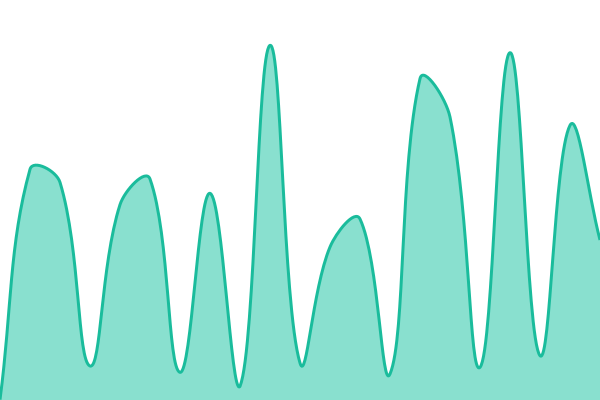 686ms
     
 | 

<a href="https://h3infra.github.io/orderart-monitor/history/amrapali">100.00%</a>
    

|  [Tikka Twist](https://www.tikkatwist.com.au/) | 🟩 Up | [tikka-twist.yml](https://github.com/h3infra/orderart-monitor/commits/HEAD/history/tikka-twist.yml) | 

 1139ms
     
 | 

<a href="https://h3infra.github.io/orderart-monitor/history/tikka-twist">100.00%</a>
    

|  [St Germain Kebab](https://www.stgermainkebab.com.au/) | 🟩 Up | [st-germain-kebab.yml](https://github.com/h3infra/orderart-monitor/commits/HEAD/history/st-germain-kebab.yml) | 

 874ms
     
 | 

<a href="https://h3infra.github.io/orderart-monitor/history/st-germain-kebab">100.00%</a>
    

|  [St Germain Cranbourne](https://cranbourne.stgermainkebab.com.au/) | 🟩 Up | [st-germain-cranbourne.yml](https://github.com/h3infra/orderart-monitor/commits/HEAD/history/st-germain-cranbourne.yml) | 

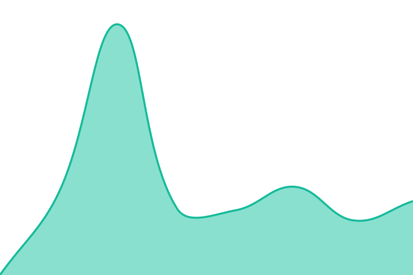 693ms
     
 | 

<a href="https://h3infra.github.io/orderart-monitor/history/st-germain-cranbourne">100.00%</a>
    

|  [Sandros](https://www.sandros.com.au/) | 🟩 Up | [sandros.yml](https://github.com/h3infra/orderart-monitor/commits/HEAD/history/sandros.yml) | 

 753ms
     
 | 

<a href="https://h3infra.github.io/orderart-monitor/history/sandros">100.00%</a>
    

|  [Mehfil Restaurant](https://www.mehfilrestaurant.com.au/) | 🟩 Up | [mehfil-restaurant.yml](https://github.com/h3infra/orderart-monitor/commits/HEAD/history/mehfil-restaurant.yml) | 

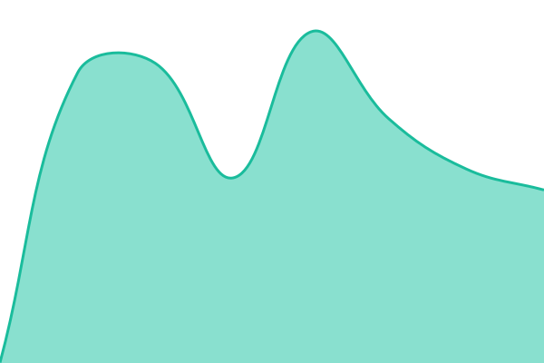 740ms
     
 | 

<a href="https://h3infra.github.io/orderart-monitor/history/mehfil-restaurant">100.00%</a>
    

|  [Wabi Sushi Prahran](https://prahran.wabisushi.com.au/) | 🟩 Up | [wabi-sushi-prahran.yml](https://github.com/h3infra/orderart-monitor/commits/HEAD/history/wabi-sushi-prahran.yml) | 

 831ms
     
 | 

<a href="https://h3infra.github.io/orderart-monitor/history/wabi-sushi-prahran">100.00%</a>
    

|  [Wabi Sushi Richmond](https://richmond.wabisushi.com.au/) | 🟩 Up | [wabi-sushi-richmond.yml](https://github.com/h3infra/orderart-monitor/commits/HEAD/history/wabi-sushi-richmond.yml) | 

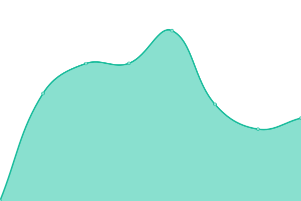 778ms
     
 | 

<a href="https://h3infra.github.io/orderart-monitor/history/wabi-sushi-richmond">100.00%</a>
    

|  [Wabi Sushi Hawthorn](https://hawthorn.wabisushi.com.au/) | 🟩 Up | [wabi-sushi-hawthorn.yml](https://github.com/h3infra/orderart-monitor/commits/HEAD/history/wabi-sushi-hawthorn.yml) | 

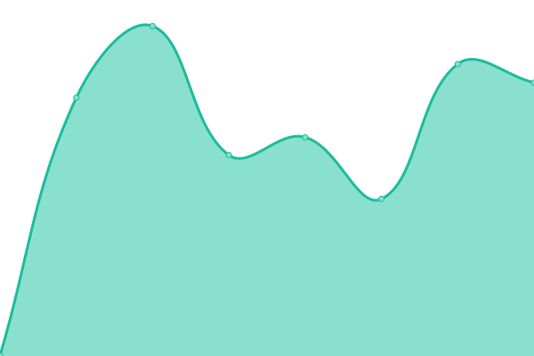 769ms
     
 | 

<a href="https://h3infra.github.io/orderart-monitor/history/wabi-sushi-hawthorn">100.00%</a>
    

|  [Sanjha Chulha NC](https://www.sanjhachulhanc.com/) | 🟩 Up | [sanjha-chulha-nc.yml](https://github.com/h3infra/orderart-monitor/commits/HEAD/history/sanjha-chulha-nc.yml) | 

 791ms
     
 | 

<a href="https://h3infra.github.io/orderart-monitor/history/sanjha-chulha-nc">100.00%</a>
    

|  [Urban Turban NC](https://www.urbanturbannc.com/) | 🟩 Up | [urban-turban-nc.yml](https://github.com/h3infra/orderart-monitor/commits/HEAD/history/urban-turban-nc.yml) | 

 758ms
     
 | 

<a href="https://h3infra.github.io/orderart-monitor/history/urban-turban-nc">100.00%</a>
    

|  [Urban Turban Express](https://express.urbanturbannc.com/) | 🟩 Up | [urban-turban-express.yml](https://github.com/h3infra/orderart-monitor/commits/HEAD/history/urban-turban-express.yml) | 

 865ms
     
 | 

<a href="https://h3infra.github.io/orderart-monitor/history/urban-turban-express">100.00%</a>
    

|  [Daawat](https://www.daawat.com.au/) | 🟩 Up | [daawat.yml](https://github.com/h3infra/orderart-monitor/commits/HEAD/history/daawat.yml) | 

 717ms
     
 | 

<a href="https://h3infra.github.io/orderart-monitor/history/daawat">100.00%</a>
    

|  [Zircon Restaurant](https://www.zirconrestaurant.com.au/) | 🟩 Up | [zircon-restaurant.yml](https://github.com/h3infra/orderart-monitor/commits/HEAD/history/zircon-restaurant.yml) | 

 739ms
     
 | 

<a href="https://h3infra.github.io/orderart-monitor/history/zircon-restaurant">100.00%</a>
    

|  [Upalis Melbourne](https://www.upalismelbourne.com.au/) | 🟩 Up | [upalis-melbourne.yml](https://github.com/h3infra/orderart-monitor/commits/HEAD/history/upalis-melbourne.yml) | 

 859ms
     
 | 

<a href="https://h3infra.github.io/orderart-monitor/history/upalis-melbourne">100.00%</a>
    

|  [Simply Indian Melton](https://melton.simplyindian.net.au/) | 🟩 Up | [simply-indian-melton.yml](https://github.com/h3infra/orderart-monitor/commits/HEAD/history/simply-indian-melton.yml) | 

 752ms
     
 | 

<a href="https://h3infra.github.io/orderart-monitor/history/simply-indian-melton">100.00%</a>
    

|  [Simply Indian Harris Park](https://harrispark.simplyindian.net.au/) | 🟩 Up | [simply-indian-harris-park.yml](https://github.com/h3infra/orderart-monitor/commits/HEAD/history/simply-indian-harris-park.yml) | 

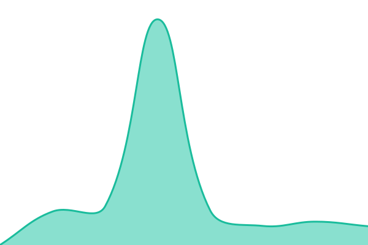 722ms
     
 | 

<a href="https://h3infra.github.io/orderart-monitor/history/simply-indian-harris-park">100.00%</a>
    

|  [Simply Indian Hoppers Crossing](https://hopperscrossing.simplyindian.net.au/) | 🟩 Up | [simply-indian-hoppers-crossing.yml](https://github.com/h3infra/orderart-monitor/commits/HEAD/history/simply-indian-hoppers-crossing.yml) | 

 761ms
     
 | 

<a href="https://h3infra.github.io/orderart-monitor/history/simply-indian-hoppers-crossing">100.00%</a>
    

|  [Punjabi Sunrise](https://www.punjabisunriserestaurant.com.au/) | 🟩 Up | [punjabi-sunrise.yml](https://github.com/h3infra/orderart-monitor/commits/HEAD/history/punjabi-sunrise.yml) | 

 711ms
     
 | 

<a href="https://h3infra.github.io/orderart-monitor/history/punjabi-sunrise">100.00%</a>
    

|  [111 Pizza Place](https://www.111pizzaplace.com.au/) | 🟩 Up | [111-pizza-place.yml](https://github.com/h3infra/orderart-monitor/commits/HEAD/history/111-pizza-place.yml) | 

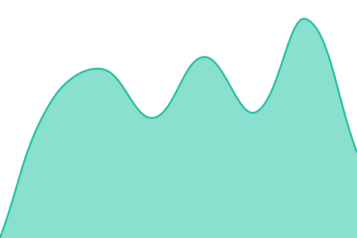 745ms
     
 | 

<a href="https://h3infra.github.io/orderart-monitor/history/111-pizza-place">100.00%</a>
    

|  [Cafe Marina Pizzeria](https://www.cafemarinapizzeria.com.au/) | 🟩 Up | [cafe-marina-pizzeria.yml](https://github.com/h3infra/orderart-monitor/commits/HEAD/history/cafe-marina-pizzeria.yml) | 

 785ms
     
 | 

<a href="https://h3infra.github.io/orderart-monitor/history/cafe-marina-pizzeria">100.00%</a>
    

|  [Welcome Restaurant](https://www.welcomerestaurant.com.au/) | 🟩 Up | [welcome-restaurant.yml](https://github.com/h3infra/orderart-monitor/commits/HEAD/history/welcome-restaurant.yml) | 

 703ms
     
 | 

<a href="https://h3infra.github.io/orderart-monitor/history/welcome-restaurant">100.00%</a>
    

|  [Fathimas Waverly](https://waverly.fathimasindiankitchen.com.au/) | 🟩 Up | [fathimas-waverly.yml](https://github.com/h3infra/orderart-monitor/commits/HEAD/history/fathimas-waverly.yml) | 

 1222ms
     
 | 

<a href="https://h3infra.github.io/orderart-monitor/history/fathimas-waverly">100.00%</a>
    

|  [Fathimas Glen](https://glen.fathimasindiankitchen.com.au/) | 🟩 Up | [fathimas-glen.yml](https://github.com/h3infra/orderart-monitor/commits/HEAD/history/fathimas-glen.yml) | 

 863ms
     
 | 

<a href="https://h3infra.github.io/orderart-monitor/history/fathimas-glen">100.00%</a>
    

|  [Afghan BBQ](https://www.afghanbbq.com.au/) | 🟩 Up | [afghan-bbq.yml](https://github.com/h3infra/orderart-monitor/commits/HEAD/history/afghan-bbq.yml) | 

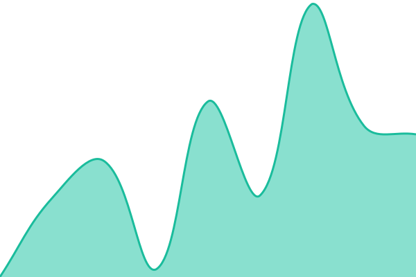 759ms
     
 | 

<a href="https://h3infra.github.io/orderart-monitor/history/afghan-bbq">100.00%</a>
    

|  [Casey Kebab](https://www.caseykebab.com.au/) | 🟩 Up | [casey-kebab.yml](https://github.com/h3infra/orderart-monitor/commits/HEAD/history/casey-kebab.yml) | 

 704ms
     
 | 

<a href="https://h3infra.github.io/orderart-monitor/history/casey-kebab">100.00%</a>
    

|  [Curry Kingdom](https://www.currykingdom.com.au/) | 🟩 Up | [curry-kingdom.yml](https://github.com/h3infra/orderart-monitor/commits/HEAD/history/curry-kingdom.yml) | 

 784ms
     
 | 

<a href="https://h3infra.github.io/orderart-monitor/history/curry-kingdom">100.00%</a>
    

|  [Rooks Pizza Diner](https://www.rookspizzadiner.com.au/) | 🟩 Up | [rooks-pizza-diner.yml](https://github.com/h3infra/orderart-monitor/commits/HEAD/history/rooks-pizza-diner.yml) | 

 746ms
     
 | 

<a href="https://h3infra.github.io/orderart-monitor/history/rooks-pizza-diner">100.00%</a>
    

|  [Masala Dosa](https://www.masaladosa.com.au/) | 🟩 Up | [masala-dosa.yml](https://github.com/h3infra/orderart-monitor/commits/HEAD/history/masala-dosa.yml) | 

 733ms
     
 | 

<a href="https://h3infra.github.io/orderart-monitor/history/masala-dosa">100.00%</a>
    

|  [Tandoori Hub](https://www.tandoorihub.com.au/) | 🟩 Up | [tandoori-hub.yml](https://github.com/h3infra/orderart-monitor/commits/HEAD/history/tandoori-hub.yml) | 

 916ms
     
 | 

<a href="https://h3infra.github.io/orderart-monitor/history/tandoori-hub">100.00%</a>
    

|  [Khazana](https://www.khazana.com.au/) | 🟩 Up | [khazana.yml](https://github.com/h3infra/orderart-monitor/commits/HEAD/history/khazana.yml) | 

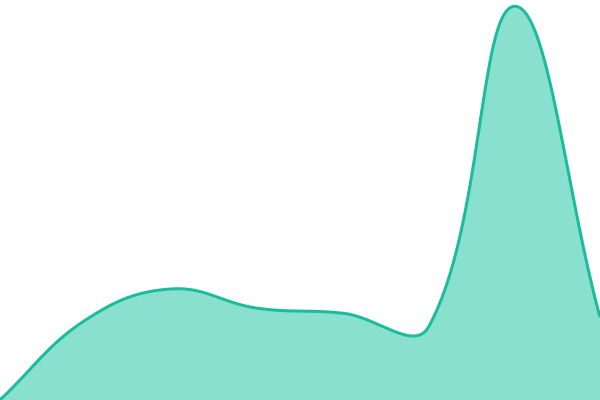 852ms
     
 | 

<a href="https://h3infra.github.io/orderart-monitor/history/khazana">100.00%</a>
    

|  [Masala Bar Grill](https://www.masalabarandgrill.com.au/) | 🟩 Up | [masala-bar-grill.yml](https://github.com/h3infra/orderart-monitor/commits/HEAD/history/masala-bar-grill.yml) | 

 835ms
     
 | 

<a href="https://h3infra.github.io/orderart-monitor/history/masala-bar-grill">100.00%</a>
    

|  [Tadka Mornington](https://mornington.thetadkaclub.com.au/) | 🟩 Up | [tadka-mornington.yml](https://github.com/h3infra/orderart-monitor/commits/HEAD/history/tadka-mornington.yml) | 

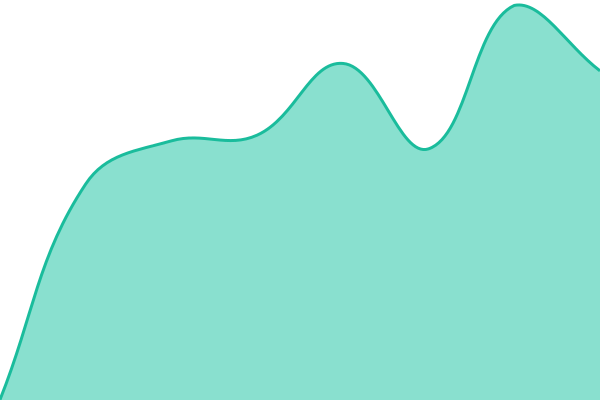 1352ms
     
 | 

<a href="https://h3infra.github.io/orderart-monitor/history/tadka-mornington">100.00%</a>
    

|  [Tadka Club](https://www.thetadkaclub.com.au/) | 🟩 Up | [tadka-club.yml](https://github.com/h3infra/orderart-monitor/commits/HEAD/history/tadka-club.yml) | 

 886ms
     
 | 

<a href="https://h3infra.github.io/orderart-monitor/history/tadka-club">100.00%</a>
    

|  [3 Bros Kebab](https://www.3broskebab.com.au/) | 🟩 Up | [3-bros-kebab.yml](https://github.com/h3infra/orderart-monitor/commits/HEAD/history/3-bros-kebab.yml) | 

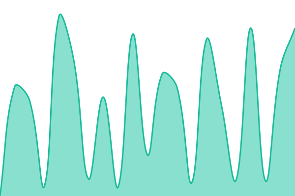 706ms
     
 | 

<a href="https://h3infra.github.io/orderart-monitor/history/3-bros-kebab">100.00%</a>
    

|  [3 Bros Beaconsfield](https://beaconsfield.3broskebab.com.au/) | 🟩 Up | [3-bros-beaconsfield.yml](https://github.com/h3infra/orderart-monitor/commits/HEAD/history/3-bros-beaconsfield.yml) | 

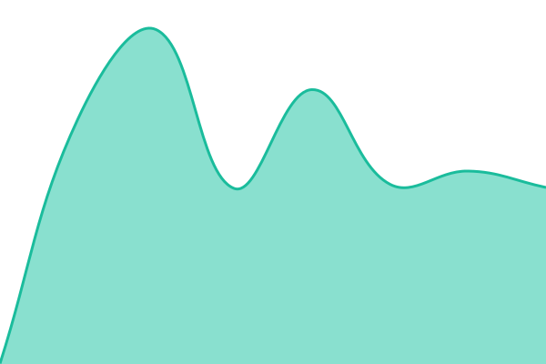 644ms
     
 | 

<a href="https://h3infra.github.io/orderart-monitor/history/3-bros-beaconsfield">100.00%</a>
    

|  [Doublepour](https://www.doublepour.com.au/) | 🟩 Up | [doublepour.yml](https://github.com/h3infra/orderart-monitor/commits/HEAD/history/doublepour.yml) | 

 892ms
     
 | 

<a href="https://h3infra.github.io/orderart-monitor/history/doublepour">100.00%</a>
    

|  [Chilli Lounge](https://www.chillilounge.com.au/) | 🟩 Up | [chilli-lounge.yml](https://github.com/h3infra/orderart-monitor/commits/HEAD/history/chilli-lounge.yml) | 

 853ms
     
 | 

<a href="https://h3infra.github.io/orderart-monitor/history/chilli-lounge">100.00%</a>
    

|  [Angaara](https://www.angaararestaurant.com.au/) | 🟩 Up | [angaara.yml](https://github.com/h3infra/orderart-monitor/commits/HEAD/history/angaara.yml) | 

 723ms
     
 | 

<a href="https://h3infra.github.io/orderart-monitor/history/angaara">100.00%</a>
    

|  [Desi Sweet](https://www.desisweet.com.au/) | 🟩 Up | [desi-sweet.yml](https://github.com/h3infra/orderart-monitor/commits/HEAD/history/desi-sweet.yml) | 

 745ms
     
 | 

<a href="https://h3infra.github.io/orderart-monitor/history/desi-sweet">100.00%</a>
    

|  [Jai Ho Hoppers](https://jaihorestauranthopperscrossing.com.au/) | 🟩 Up | [jai-ho-hoppers.yml](https://github.com/h3infra/orderart-monitor/commits/HEAD/history/jai-ho-hoppers.yml) | 

 468ms
     
 | 

<a href="https://h3infra.github.io/orderart-monitor/history/jai-ho-hoppers">100.00%</a>
    

|  [Highway Eats](https://www.thehighwayeats.com.au/) | 🟩 Up | [highway-eats.yml](https://github.com/h3infra/orderart-monitor/commits/HEAD/history/highway-eats.yml) | 

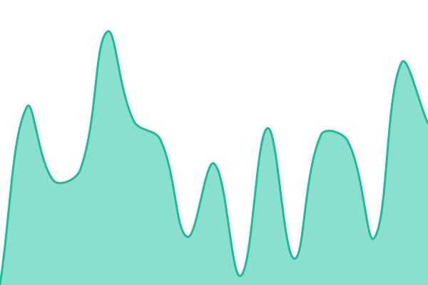 970ms
     
 | 

<a href="https://h3infra.github.io/orderart-monitor/history/highway-eats">100.00%</a>
    

|  [Highway Eats Officer](https://officer.thehighwayeats.com.au/) | 🟩 Up | [highway-eats-officer.yml](https://github.com/h3infra/orderart-monitor/commits/HEAD/history/highway-eats-officer.yml) | 

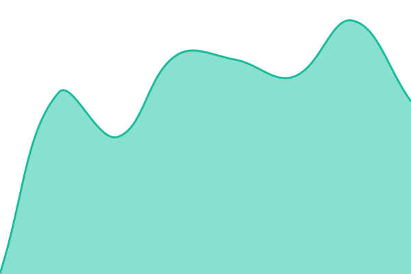 934ms
     
 | 

<a href="https://h3infra.github.io/orderart-monitor/history/highway-eats-officer">100.00%</a>
    

|  [Bikaner Sweets](https://www.bikanersweetsandcurrycafe.com.au/) | 🟩 Up | [bikaner-sweets.yml](https://github.com/h3infra/orderart-monitor/commits/HEAD/history/bikaner-sweets.yml) | 

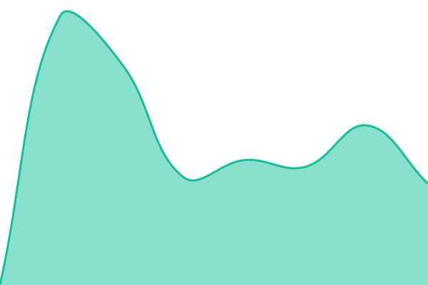 1508ms
     
 | 

<a href="https://h3infra.github.io/orderart-monitor/history/bikaner-sweets">100.00%</a>
    

|  [Colors Indian](https://www.colorsindianrestaurant.com.au/) | 🟩 Up | [colors-indian.yml](https://github.com/h3infra/orderart-monitor/commits/HEAD/history/colors-indian.yml) | 

 714ms
     
 | 

<a href="https://h3infra.github.io/orderart-monitor/history/colors-indian">100.00%</a>
    

|  [Sahibeswad Clayton](https://clayton.sahibeswad.com.au/) | 🟩 Up | [sahibeswad-clayton.yml](https://github.com/h3infra/orderart-monitor/commits/HEAD/history/sahibeswad-clayton.yml) | 

 863ms
     
 | 

<a href="https://h3infra.github.io/orderart-monitor/history/sahibeswad-clayton">100.00%</a>
    

|  [Sahibeswad Werribee](https://werribee.sahibeswad.com.au/) | 🟩 Up | [sahibeswad-werribee.yml](https://github.com/h3infra/orderart-monitor/commits/HEAD/history/sahibeswad-werribee.yml) | 

 853ms
     
 | 

<a href="https://h3infra.github.io/orderart-monitor/history/sahibeswad-werribee">100.00%</a>
    

|  [Sahibeswad Truganina](https://truganina.sahibeswad.com.au/) | 🟩 Up | [sahibeswad-truganina.yml](https://github.com/h3infra/orderart-monitor/commits/HEAD/history/sahibeswad-truganina.yml) | 

 808ms
     
 | 

<a href="https://h3infra.github.io/orderart-monitor/history/sahibeswad-truganina">100.00%</a>
    

|  [Kuch Bhi Eats](https://online.kuchbhieats.com/) | 🟥 Down | [kuch-bhi-eats.yml](https://github.com/h3infra/orderart-monitor/commits/HEAD/history/kuch-bhi-eats.yml) | 

 1866ms
     
 | 

<a href="https://h3infra.github.io/orderart-monitor/history/kuch-bhi-eats">100.00%</a>
    

|  [The Bhojan](https://www.thebhojan.ca/) | 🟩 Up | [the-bhojan.yml](https://github.com/h3infra/orderart-monitor/commits/HEAD/history/the-bhojan.yml) | 

 704ms
     
 | 

<a href="https://h3infra.github.io/orderart-monitor/history/the-bhojan">100.00%</a>
    

<!--end: status pages-->

[**Visit status website →**](https://h3infra.github.io/orderart-monitor/)
